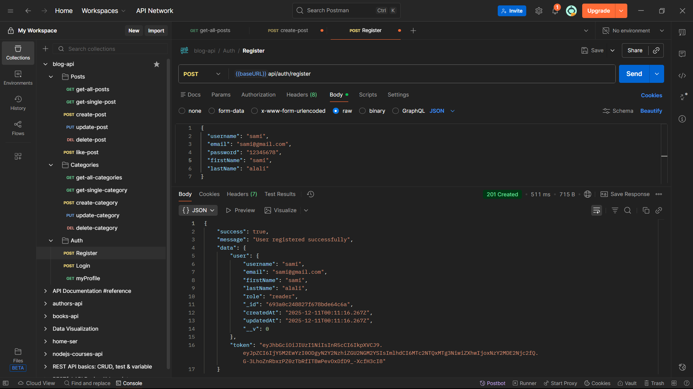
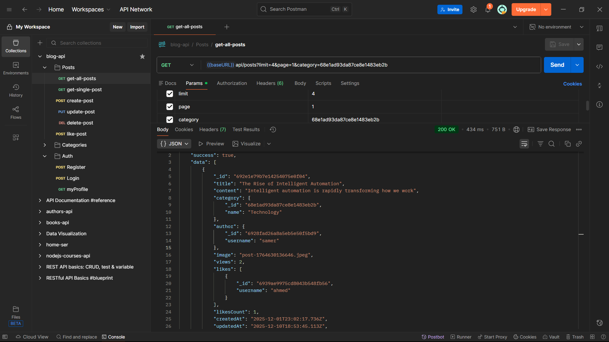
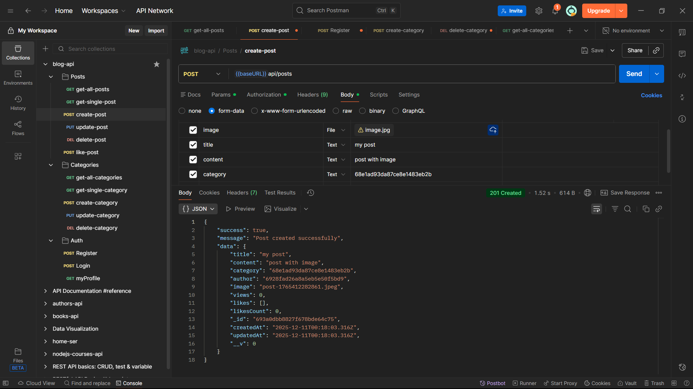
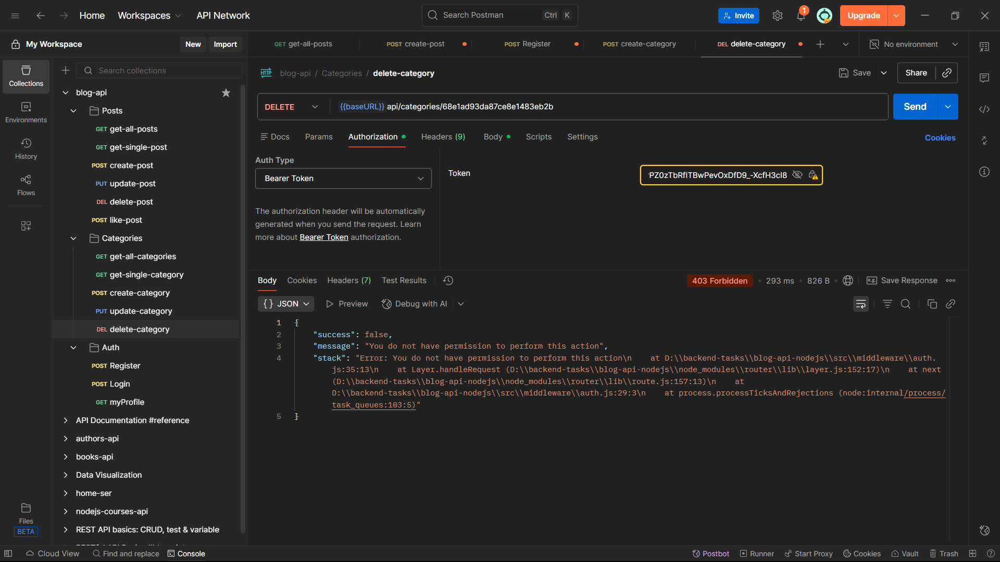

# 📝 Blog API

A RESTful API for a blog platform built with Node.js, Express.js, and MongoDB. This API provides comprehensive blog management features including user authentication, post management, categories, and social interactions.

## ✨ Features

### 📄 Post Management

- Post CRUD operations
- Image upload and processing with Multer and Sharp
- Like / Dislike posts

### 🏷️ Categories

- Category CRUD operations
- Assign posts to categories
- Filter posts by category

### 🔍 Advanced Features

- Pagination
- Search by title and content
- Sort by date, likes, views

### 🔐 Authentication & Authorization

- JWT-based auth
- Secure password hashing with bcrypt
- Role-based permissions (Admin, Editor, User)

### 📝 Validation

- Schema-based validation using Joi
- Validates requests for users, posts, and categories

### ❗ Error Handling

- Centralized error handler
- Custom Error response format
- Async error wrapper

## 🛠️ Technologies Used

- Runtime: Node.js
- Framework: Express.js
- Database: MongoDB with Mongoose ODM
- Authentication: JWT (jsonwebtoken)
- Password Hashing: bcrypt
- Validation: Joi
- File Upload: Multer
- Image Processing: Sharp
- Environment Variables: dotenv

## 🚀 Installation

1. Clone the repository

```bash
https://github.com/o-arafa/blog-api-nodejs.git
cd blog-api-nodejs
```

2. Install dependencies

```bash
npm install
```

3. Configure environment variables
   create .env file, and add the required configurations

```
NODE_ENV=development
PORT=5000
MONGODB_URI=mongodb+srv://<username>:<password>@<cluster-name>.mongodb.net/<database-name>
JWT_SECRET=your_super_secret_jwt_key_change_this
JWT_EXPIRE=7d
```

4. Run the application

```bash
# Development mode
npm run dev

# Production mode
npm start
```

## 📁 Project Structure

```
blog-api-nodejs/
├── node_modules/
├── uploads/
│   └── posts/          # Uploaded post images
├── src/
│   ├── controllers/    # Request handlers
│   ├── middleware/     # Custom middleware
│   ├── models/         # Mongoose models
│   ├── routes/         # API routes
│   ├── validations/    # Joi validation schemas
│   ├── config/         # Configuration files
│   ├── utils/          # Utility functions
│   └── app.js          # Express app setup
├── .env                # Environment variables
├── .gitignore
├── package.json
└── server.js           # Entry point
```

## 📸 API Examples

### Register



### Get All Posts



### Create Post with image



### Unauthorized Action



## 👤 Author

**Obeida Arafa**

- GitHub: [@o-arafa](https://github.com/o-arafa)
- LinkedIn: [Obeida Arafa](https://linkedin.com/in/o-arafa)
- Email: obeidaarafa@gmail.com

---

## ⭐ Show your support

Give a ⭐️ if you like this project!
